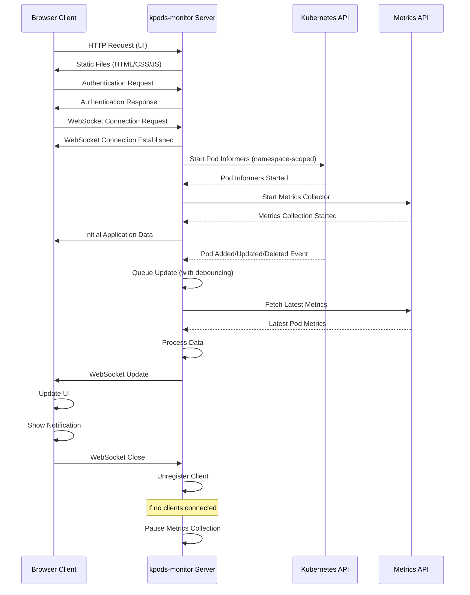
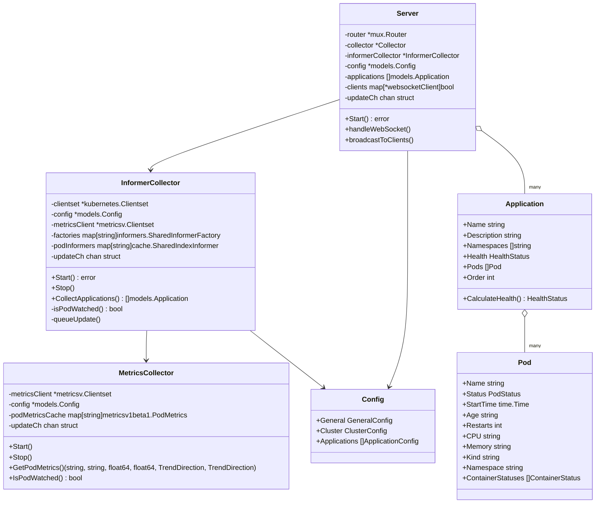
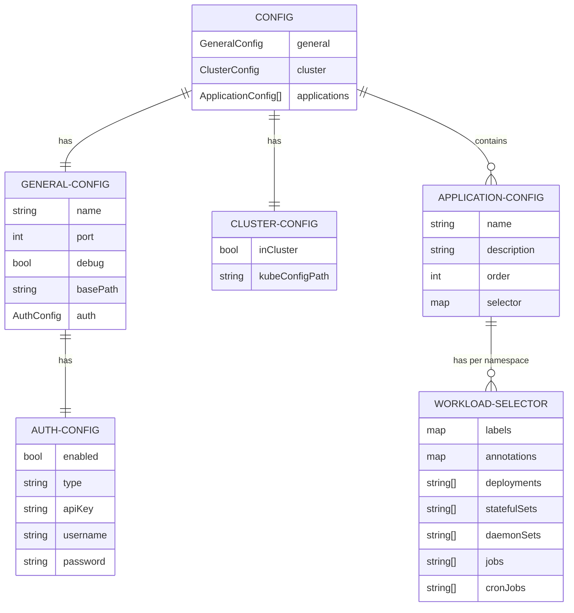

# kpods-monitor Architecture

## System Architecture Diagram

```mermaid
graph TB
    %% Main Components
    Client[Browser Client]
    Server[HTTP Server]
    K8sAPI[Kubernetes API]
    MetricsAPI[Kubernetes Metrics API]

    %% Server Components
    subgraph "kpods-monitor Server"
        Router[Mux Router]
        APIRouter[API Router]
        StaticFiles[Static File Server]

        %% API Components
        subgraph "API Layer"
            AppHandler[Applications Handler]
            NSHandler[Namespaces Handler]
            ConfigHandler[Config Handler]
            WSHandler[WebSocket Handler]
            HealthHandler[Health Endpoints]
        end

        %% Data Collection Components
        subgraph "Data Collection"
            InformerCollector[Informer Collector]
            MetricsCollector[Metrics Collector]
            PodInformers[Pod Informers]
            UpdateChannel[Update Channel]
        end

        %% Authentication & Security
        subgraph "Security"
            AuthMiddleware[Auth Middleware]
            RateLimiter[Rate Limiter]
            SecurityHeaders[Security Headers]
        end
    end

    %% Client Components
    subgraph "Browser Client"
        UI[UI Components]
        WSClient[WebSocket Client]
        NotificationSystem[Notification System]
        StateManagement[State Management]
    end

    %% Kubernetes Components
    subgraph "Kubernetes"
        Pods[Pods]
        Deployments[Deployments]
        StatefulSets[StatefulSets]
        DaemonSets[DaemonSets]
    end

    %% Connections
    Client -- HTTP Requests --> Server
    Client -- WebSocket --> WSHandler

    Router --> APIRouter
    Router --> StaticFiles
    Router --> HealthHandler

    APIRouter --> AppHandler
    APIRouter --> NSHandler
    APIRouter --> ConfigHandler
    APIRouter --> WSHandler

    APIRouter -. Auth .-> AuthMiddleware
    APIRouter -. Rate Limiting .-> RateLimiter

    AppHandler --> InformerCollector
    WSHandler --> InformerCollector

    InformerCollector --> PodInformers
    InformerCollector --> MetricsCollector
    PodInformers -- Watch Events --> UpdateChannel
    MetricsCollector -- Metrics Updates --> UpdateChannel
    UpdateChannel --> WSHandler

    PodInformers -- Watch --> K8sAPI
    MetricsCollector -- Fetch Metrics --> MetricsAPI

    K8sAPI -- Manages --> Pods
    K8sAPI -- Manages --> Deployments
    K8sAPI -- Manages --> StatefulSets
    K8sAPI -- Manages --> DaemonSets

    WSHandler -- Updates --> WSClient
    WSClient --> StateManagement
    StateManagement --> UI
    StateManagement --> NotificationSystem

    classDef primary fill:#f9f,stroke:#333,stroke-width:2px;
    classDef secondary fill:#bbf,stroke:#333,stroke-width:1px;
    classDef tertiary fill:#dfd,stroke:#333,stroke-width:1px;

    class Server,Client primary;
    class Router,APIRouter,InformerCollector,WSHandler secondary;
    class PodInformers,MetricsCollector,UpdateChannel,WSClient tertiary;
```

## Data Flow Diagram

```mermaid
sequenceDiagram
    participant Client as Browser Client
    participant Server as kpods-monitor Server
    participant K8s as Kubernetes API
    participant Metrics as Metrics API

    %% Initial Connection
    Client->>Server: HTTP Request (UI)
    Server->>Client: Static Files (HTML/CSS/JS)

    %% Authentication
    Client->>Server: Authentication Request
    Server->>Client: Authentication Response

    %% WebSocket Connection
    Client->>Server: WebSocket Connection Request
    Server->>Client: WebSocket Connection Established

    %% Initial Data
    Server->>K8s: Start Pod Informers (namespace-scoped)
    K8s-->>Server: Pod Informers Started
    Server->>Metrics: Start Metrics Collector
    Metrics-->>Server: Metrics Collection Started
    Server->>Client: Initial Application Data

    %% Real-time Updates
    K8s-->>Server: Pod Added/Updated/Deleted Event
    Server->>Server: Queue Update (with debouncing)
    Server->>Metrics: Fetch Latest Metrics
    Metrics-->>Server: Latest Pod Metrics
    Server->>Server: Process Data
    Server->>Client: WebSocket Update
    Client->>Client: Update UI
    Client->>Client: Show Notification

    %% Client Disconnection
    Client->>Server: WebSocket Close
    Server->>Server: Unregister Client

    %% No Clients Connected
    Note over Server: If no clients connected
    Server->>Server: Pause Metrics Collection
```

## Component Structure

```mermaid
classDiagram
    class Server {
        -router *mux.Router
        -collector *Collector
        -informerCollector *InformerCollector
        -config *models.Config
        -applications []models.Application
        -clients map[*websocketClient]bool
        -updateCh chan struct
        +Start() error
        +handleWebSocket()
        +broadcastToClients()
    }

    class InformerCollector {
        -clientset *kubernetes.Clientset
        -config *models.Config
        -metricsClient *metricsv.Clientset
        -factories map[string]informers.SharedInformerFactory
        -podInformers map[string]cache.SharedIndexInformer
        -updateCh chan struct
        +Start() error
        +Stop()
        +CollectApplications() []models.Application
        -isPodWatched() bool
        -queueUpdate()
    }

    class MetricsCollector {
        -metricsClient *metricsv.Clientset
        -config *models.Config
        -podMetricsCache map[string]metricsv1beta1.PodMetrics
        -updateCh chan struct
        +Start()
        +Stop()
        +GetPodMetrics() (string, string, float64, float64, TrendDirection, TrendDirection)
        +IsPodWatched() bool
    }

    class Application {
        +Name string
        +Description string
        +Namespaces []string
        +Health HealthStatus
        +Pods []Pod
        +Order int
        +CalculateHealth() HealthStatus
    }

    class Pod {
        +Name string
        +Status PodStatus
        +StartTime time.Time
        +Age string
        +Restarts int
        +CPU string
        +Memory string
        +Kind string
        +Namespace string
        +ContainerStatuses []ContainerStatus
    }

    class Config {
        +General GeneralConfig
        +Cluster ClusterConfig
        +Applications []ApplicationConfig
    }

    Server --> InformerCollector
    Server --> Config
    Server o-- "many" Application
    InformerCollector --> MetricsCollector
    InformerCollector --> Config
    Application o-- "many" Pod
```

## Configuration Structure

```mermaid
erDiagram
    CONFIG {
        GeneralConfig general
        ClusterConfig cluster
        ApplicationConfig[] applications
    }

    GENERAL-CONFIG {
        string name
        int port
        bool debug
        string basePath
        AuthConfig auth
    }

    AUTH-CONFIG {
        bool enabled
        string type
        string apiKey
        string username
        string password
    }

    CLUSTER-CONFIG {
        bool inCluster
        string kubeConfigPath
    }

    APPLICATION-CONFIG {
        string name
        string description
        int order
        map selector
    }

    WORKLOAD-SELECTOR {
        map labels
        map annotations
        string[] deployments
        string[] statefulSets
        string[] daemonSets
        string[] jobs
        string[] cronJobs
    }

    CONFIG ||--|| GENERAL-CONFIG : has
    CONFIG ||--|| CLUSTER-CONFIG : has
    CONFIG ||--o{ APPLICATION-CONFIG : contains
    GENERAL-CONFIG ||--|| AUTH-CONFIG : has
    APPLICATION-CONFIG ||--o{ WORKLOAD-SELECTOR : "has per namespace"
```
